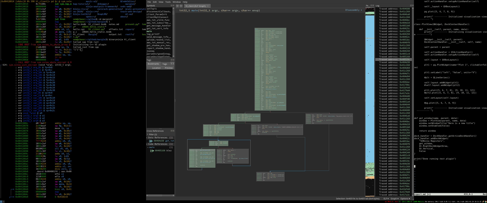
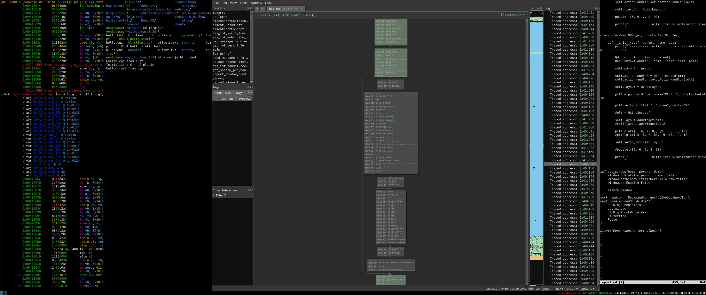

# Report

## Introductions


## Manual Reverse Engineering

### strcpy

I began my analysis process with a manual analysis of the `hl_client` binary using radare2. Hoping to find some low-hanging-fruit, I started by looking for cross references to commonly vulnerable library calls. Here I get a list of imports, filtering to those containing the string "str".

```
[0x0041112c]> ii~str
4   0x004015dc GLOBAL FUNC       strcpy
37  0x004017bc GLOBAL FUNC       strnlen
51  0x0040185c GLOBAL FUNC       strstr
54  0x0040188c GLOBAL FUNC       strncmp
57  0x004018bc GLOBAL FUNC       strncpy
76  0x0040199c GLOBAL FUNC       strcmp
96  0x00401aac GLOBAL FUNC       strlen
97  0x00401abc GLOBAL FUNC       strchr
```

It looks like this binary imports strcpy. We can get cross references to it using the following command.

```
[0x0041112c]> axt strcpy
sym.read_IP_file 0x401ba8 [CALL] jal strcpy
sym.msgarrv 0x40370c [CALL] jal strcpy
sym.msgarrv 0x4039ac [CALL] jal strcpy
sym.print_string_ptr 0x413d60 [CALL] jal strcpy
sym.print_object 0x416060 [CALL] jal strcpy
sym.iot_get_log_handler 0x418a3c [CALL] jal strcpy
sym.iot_delete_sensor_handler 0x419000 [CALL] jal strcpy
sym.iot_bind_cancel_handler 0x41952c [CALL] jal strcpy
```

Manual analysis revealed that most of the uses are innocuous. For example, copying static strings embeded in the binary to an appropriatley sized buffer. However, at least one of them appears to be vulnerable to a classic buffer overflow. We'll start by disassembling the block containing the relevant cross reference.

```
:> pdb 0x401b64
│           0x00401b64      b800c48f       lw a0, 0xb8(fp)
│           0x00401b68      4200023c       lui v0, 0x42                ; 'B'
│           0x00401b6c      689b4524       addiu a1, v0, -0x6498
│           0x00401b70      9470100c       jal fopen                   ; file*fopen(const char *filename, const char *mode)
│           0x00401b74      00000000       nop
│           0x00401b78      1800c2af       sw v0, 0x18(fp)
│           0x00401b7c      2400c227       addiu v0, fp, 0x24
│           0x00401b80      21204000       move a0, v0
│           0x00401b84      01000524       addiu a1, zero, 1
│           0x00401b88      80000624       addiu a2, zero, 0x80
│           0x00401b8c      1800c78f       lw a3, 0x18(fp)
│           0x00401b90      8470100c       jal fread                   ; size_t fread(void *ptr, size_t size, size_t nmemb, FILE *stream)
│           0x00401b94      00000000       nop
│           0x00401b98      2000c2af       sw v0, 0x20(fp)
│           0x00401b9c      2400c227       addiu v0, fp, 0x24
│           0x00401ba0      b000c48f       lw a0, 0xb0(fp)             ; [0x178000:4]=0
│           0x00401ba4      21284000       move a1, v0
│           0x00401ba8      bc6f100c       jal strcpy                  ; char *strcpy(char *dest, const char *src)
│           0x00401bac      00000000       nop
```

So it looks like it opens a file and copies the data, regardless of size, to a buffer. Let's trace this back by getting cross references to the function.

```
:> axt
sym.getServerStr 0x401ce8 [CALL] jal sym.read_IP_file
```

We can seek to the function.

```
[0x00401ca4]> pdb
            ; CALL XREF from sym.client_ParamInit @ 0x403dc4
┌ 124: sym.getServerStr (int32_t arg1, int32_t arg3, int32_t arg_18h);
│           ; arg int32_t arg_18h @ fp+0x18
│           ; var int32_t var_18h @ sp+0x18
│           ; var int32_t var_20h @ sp+0x20
│           ; var int32_t var_24h @ sp+0x24
│           ; arg int32_t arg1 @ a0
│           ; arg int32_t arg3 @ a2
│           0x00401ca4      d8ffbd27       addiu sp, sp, -0x28
│           0x00401ca8      2400bfaf       sw ra, 0x24(sp)
│           0x00401cac      2000beaf       sw fp, 0x20(sp)
│           0x00401cb0      21f0a003       move fp, sp
│           0x00401cb4      1800c0af       sw zero, 0x18(fp)
│           0x00401cb8      4300023c       lui v0, 0x43                ; 'C'
│           0x00401cbc      e0e24424       addiu a0, v0, -0x1d20       ; 0x42e2e0
│                                                                      ; obj.IP_str ; arg1 ; obj.IP_str
│           0x00401cc0      21280000       move a1, zero
│           0x00401cc4      80000624       addiu a2, zero, 0x80        ; arg3
│           0x00401cc8      9870100c       jal memset                  ; void *memset(void *s, int c, size_t n)
│           0x00401ccc      00000000       nop
│           0x00401cd0      4300023c       lui v0, 0x43                ; 'C'
│           0x00401cd4      e0e24424       addiu a0, v0, -0x1d20       ; 0x42e2e0
│                                                                      ; obj.IP_str ; int32_t arg1 ; obj.IP_str
│           0x00401cd8      1800c227       addiu v0, fp, 0x18
│           0x00401cdc      21284000       move a1, v0                 ; int32_t arg2
│           0x00401ce0      4200023c       lui v0, 0x42                ; 'B'
│           0x00401ce4      949b4624       addiu a2, v0, -0x646c       ; 0x419b94 ; "/configs/IOT_server.txt" ; int32_t arg_18h ; str._configs_IOT_server.txt
│           0x00401ce8      b306100c       jal sym.read_IP_file
│           0x00401cec      00000000       nop
│       ┌─< 0x00401cf0      04004014       bnez v0, 0x401d04
│       │   0x00401cf4      00000000       nop
```

So it looks like there's a buffer overflow from reading and copying the file "/configs/IOT_server.txt".

### printf

We can also look around for any format string vulnerabilities. We'll start by getting cross references to `printf`.

```
[0x0041bf00]> axt
sym.read_IP_file 0x401af8 [CALL] jal printf
sym.common_process_data 0x401d8c [CALL] jal printf
sym.parse_action 0x401fb4 [CALL] jal printf
sym.parse_action 0x402188 [CALL] jal printf
sym.parse_action 0x4021cc [CALL] jal printf
sym.parse_action 0x402210 [CALL] jal printf
sym.parse_action 0x402254 [CALL] jal printf
sym.parse_action 0x402298 [CALL] jal printf
sym.msgsend 0x4028c8 [CALL] jal printf
sym.msgsend 0x402928 [CALL] jal printf
sym.delta_handler 0x40298c [CALL] jal printf
sym.delta_handler 0x402b28 [CALL] jal printf
sym.delta_handler 0x402b9c [CALL] jal printf
sym.delta_handler 0x402c74 [CALL] jal printf
sym.get_shadow_handler 0x402cf4 [CALL] jal printf
sym.get_shadow_handler 0x402e54 [CALL] jal printf
sym.get_shadow_handler 0x402ec8 [CALL] jal printf
sym.get_shadow_handler 0x402fa0 [CALL] jal printf
sym.msgarrv 0x403038 [CALL] jal printf
sym.msgarrv 0x4030d4 [CALL] jal printf
sym.msgarrv 0x403178 [CALL] jal printf
sym.msgarrv 0x403334 [CALL] jal printf
sym.msgarrv 0x403438 [CALL] jal printf
sym.setTopic 0x403b28 [CALL] jal printf
sym.setTopic 0x403b5c [CALL] jal printf
sym.setTopic 0x403b90 [CALL] jal printf
sym.setTopic 0x403bc4 [CALL] jal printf
sym.disconnectCallbackFunc 0x403d68 [CALL] jal printf
sym.client_ParamInit 0x403ddc [CALL] jal printf
sym.client_ParamInit 0x403ec0 [CALL] jal printf
sym.clientMqttConnect 0x403f8c [CALL] jal printf
sym.clientMqttConnect 0x403fb0 [CALL] jal printf
sym.clientMqttConnect 0x4040ac [CALL] jal printf
sym.clientMqttConnect 0x4040cc [CALL] jal printf
sym.aws_iot_subscribe_publish 0x404608 [CALL] jal printf
sym.get_message_handler 0x4047e0 [CALL] jal printf
...truncated...
```

The full list is rather long. We'll filter it down by constructing a command to see if each use is preceeded by a format string. We can get the full list of cross references with the `axt printf` command. We can filter this list to just the offsets by getting the column using `~[1]` and we'll write it to a file using `> offsets.txt`. The full command is as follows.

```
[0x0041067c]> axt printf~[1] > offsets.txt
```

We can cat this list (truncated).

```
[0x0041067c]> !cat offsets.txt
0x401af8
0x401d8c
0x401fb4
0x402188
0x4021cc
0x402210
0x402254
0x402298
0x4028c8
0x402928
0x40298c
0x402b28
0x402b9c
0x402c74
0x402cf4
0x402e54
0x402ec8
0x402fa0
0x403038
0x4030d4
0x403178
0x403334
0x403438
0x403b28
0x403b5c
0x403b90
...truncated...
```

We can print the full block for each offset using the `pdb` command. We can iterate this command over the list using `@@`, giving us the full command below.

```
[0x0041067c]> pdb @@.offsets.txt
```

We can then scan through this output, making sure each use of printf has a corresponding static format string. All uses of printf appear to be secure, except for possibly this one.

```
:> pdb
│           ; CODE XREF from sym._iot_tls_verify_cert @ 0x410644
│           0x0041068c      4200023c       lui v0, 0x42                ; 'B'
│           0x00410690      60b24424       addiu a0, v0, -0x4da0       ; 0x41b260 ; "DEBUG:   %s L#%d " ; str.DEBUG:____s_L_d_
│           0x00410694      4200023c       lui v0, 0x42                ; 'B'
│           0x00410698      38b94524       addiu a1, v0, -0x46c8       ; 0x41b938 ; "_iot_tls_verify_cert" ; obj.__func__.6080
│           0x0041069c      3a000624       addiu a2, zero, 0x3a
│           0x004106a0      c06f100c       jal printf                  ; int printf(const char *format)
│           0x004106a4      00000000       nop
│           0x004106a8      2c04c28f       lw v0, 0x42c(fp)
│           0x004106ac      0000428c       lw v0, (v0)
│           0x004106b0      1800c327       addiu v1, fp, 0x18
│           0x004106b4      21206000       move a0, v1
│           0x004106b8      00040524       addiu a1, zero, 0x400
│           0x004106bc      4200033c       lui v1, 0x42                ; 'B'
│           0x004106c0      c0b26624       addiu a2, v1, -0x4d40       ; 0x41b2c0 ; "  ! " ; str.____
│           0x004106c4      21384000       move a3, v0
│           0x004106c8      c06f100c       jal printf                  ; int printf(const char *format)
│           0x004106cc      00000000       nop
│           0x004106d0      0a000424       addiu a0, zero, 0xa
│           0x004106d4      b46f100c       jal fcn.0041bed0
│           0x004106d8      00000000       nop
│           0x004106dc      4200023c       lui v0, 0x42                ; 'B'
│           0x004106e0      60b24424       addiu a0, v0, -0x4da0       ; 0x41b260 ; "DEBUG:   %s L#%d " ; str.DEBUG:____s_L_d_
│           0x004106e4      4200023c       lui v0, 0x42                ; 'B'
│           0x004106e8      38b94524       addiu a1, v0, -0x46c8       ; 0x41b938 ; "_iot_tls_verify_cert" ; obj.__func__.6080
│           0x004106ec      3b000624       addiu a2, zero, 0x3b
│           0x004106f0      c06f100c       jal printf                  ; int printf(const char *format)
│           0x004106f4      00000000       nop
│           0x004106f8      1800c227       addiu v0, fp, 0x18
│           0x004106fc      21204000       move a0, v0
│           0x00410700      0470100c       jal fcn.0041c010
│           0x00410704      00000000       nop
│           0x00410708      0a000424       addiu a0, zero, 0xa
│           0x0041070c      b46f100c       jal fcn.0041bed0
│           0x00410710      00000000       nop
```

We can see that the second printf in this basic block uses a buffer passed into the function as the format string. When manually tracing this back, we can see this is tainted by a AWS related network call. It's hard to tell purley manually if this is exploitable since there's a lot of code between the network call and the use, so it would be best to test this dynamically.

### Heap Issues

We can also look for heap issues.

```
[0x00419818]> axt sym.imp.free
(nofunc) 0x400c18 [UNKNOWN] invalid
sym.msgarrv 0x403a50 [CALL] jal sym.imp.free
sym.upload_resend_list_again 0x405510 [CALL] jal sym.imp.free
sym.upload_resend_list_again 0x405544 [CALL] jal sym.imp.free
sym.cJSON_InitHooks; sym.imp.free 0x4123a4 [DATA] addiu v1, v1, -sym.imp.free
sym.cJSON_InitHooks; sym.imp.free 0x412408 [DATA] addiu v0, v0, -sym.imp.free
sym.cJSON_Delete 0x41252c [CALL] jalr t9
sym.cJSON_Delete 0x412570 [CALL] jalr t9
sym.cJSON_Delete 0x412588 [CALL] jalr t9
sym.ensure 0x412be0 [CALL] jalr t9
sym.ensure 0x412c4c [CALL] jalr t9
sym.print_array 0x4150a8 [CALL] jalr t9
sym.print_array 0x4150e0 [CALL] jalr t9
sym.print_array 0x4151f8 [CALL] jalr t9
sym.print_array 0x415230 [CALL] jalr t9
sym.print_object 0x415c38 [CALL] jalr t9
sym.print_object 0x415e60 [CALL] jalr t9
sym.print_object 0x415ea8 [CALL] jalr t9
sym.print_object 0x415ee0 [CALL] jalr t9
sym.print_object 0x415ef8 [CALL] jalr t9
sym.print_object 0x416110 [CALL] jalr t9
sym.print_object 0x41613c [CALL] jalr t9
sym.print_object 0x416174 [CALL] jalr t9
sym.print_object 0x41618c [CALL] jalr t9
sym.cJSON_AddItemToObject 0x416560 [CALL] jalr t9
sym.cJSON_AddItemToObjectCS 0x416618 [CALL] jalr t9
sym.xxtea_ubyte_encrypt 0x4185c4 [CALL] jal sym.imp.free
sym.xxtea_ubyte_encrypt 0x418618 [CALL] jal sym.imp.free
sym.xxtea_ubyte_encrypt 0x418624 [CALL] jal sym.imp.free
sym.xxtea_ubyte_decrypt 0x4186e8 [CALL] jal sym.imp.free
sym.xxtea_ubyte_decrypt 0x41873c [CALL] jal sym.imp.free
sym.xxtea_ubyte_decrypt 0x418748 [CALL] jal sym.imp.free
sym.is_resend_action_func 0x4196c4 [CALL] jal sym.imp.free
sym.delete_guid_from_linklist 0x41981c [CALL] jal sym.imp.free
```

After scanning through these manually, there is one potential issue here.

```
:> pdb
│           ; CODE XREF from sym.xxtea_to_ubyte_array @ 0x417f98
│           0x00418008      1800c28f       lw v0, 0x18(fp)
│           0x0041800c      01004224       addiu v0, v0, 1
│           0x00418010      21204000       move a0, v0                 ; size_t size
│           0x00418014      0c70100c       jal sym.imp.malloc          ; void *malloc(size_t size)
│           0x00418018      00000000       nop
│           0x0041801c      2000c2af       sw v0, 0x20(fp)
│           0x00418020      2000c48f       lw a0, 0x20(fp)
│           0x00418024      3000c58f       lw a1, 0x30(fp)             ; [0x178000:4]=0
│           0x00418028      1800c68f       lw a2, 0x18(fp)
│           0x0041802c      fc6f100c       jal free                    ; void free(void *ptr)
│           0x00418030      00000000       nop
│           0x00418034      2000c38f       lw v1, 0x20(fp)
│           0x00418038      1800c28f       lw v0, 0x18(fp)
│           0x0041803c      21106200       addu v0, v1, v0
│           0x00418040      000040a0       sb zero, (v0)
│           0x00418044      3c00c28f       lw v0, 0x3c(fp)
│           0x00418048      1800c38f       lw v1, 0x18(fp)
│           0x0041804c      000043ac       sw v1, (v0)
│           0x00418050      2000c28f       lw v0, 0x20(fp)
```

It looks like they forgot to check the return of the malloc call and it is immediatley freed. This could lead to a null pointer dereference if the malloc call fails (there are a variety of methods for inducing this). Exploiting this kind of vulnerability, however, is generally difficult.

### Summary

The summary of my manual results is:
   - 1 simple stack buffer voerflow but you'd need to overwrite a local file
   - 6 would-be bfufer overflows (some stack, some heap) if the function containing the library call was used incorrectly, but none of those apepar to be exploitable
   - 2 format strings, exploitability not yet determined
   - 1 null poitner dereference
   - sscanf uses appear to be safe
   - A bunch of safe uses of strcpy

---

## Preliminary Emulation

In the interest of proving the exploitability of some of these vulnerabilities, I started the process of emulating the binary, though I did eventually run out of time. The appears to be an ideal use case for Qiling, a binary emulation framework built on unicorn, written in python. 

### Qiling

I wanted to be able to emulate the binary and visualize the coverage. I decided to do this by adding a basic block trace to the qiling script and dumping these addresses to a file, and then reading this file in binaryninja and highlighting the traced basic blocks. An example emulation script is below.

```
#!/usr/bin/python3

from qiling import *
import os

def hook_block(ql, address, size):
    if "0x4" in hex(address):
        print("At address: 0x%x" % address)
        with open("output.txt", "a+") as f:
            f.write(hex(address) + "\n")

def go():
    ql = Qiling(["/home/oem/margin2/hl_client"], "/home/oem/software/qiling/examples/rootfs/mips32_linux")

    ql.hook_block(hook_block)
    os.system("rm output.txt; touch output.txt")

    ql.run()

go()
```


After running the script, we can then build a small binaryninja script to visualize the contents of output.txt.

```
from binaryninja.interaction import (
    show_message_box,
    get_int_input,
    get_choice_input
)
from binaryninjaui import (
    DockHandler,
    DockContextHandler,
    getMonospaceFont,
    UIActionHandler
)

from PySide2 import QtCore
from PySide2.QtCore import Qt, QMimeData
from PySide2.QtGui import QBrush, QColor
from PySide2.QtWidgets import (
    QApplication,
    QVBoxLayout,
    QWidget,
    QComboBox,
    QTableWidget,
    QTableWidgetItem,
    QMenu
)

import pyqtgraph as pg

class RegisterView(QWidget, DockContextHandler):

    def __init__(self, parent, name, data):
        print(" ---------- Initializing visualization view ----------")

        QWidget.__init__(self, parent)
        DockContextHandler.__init__(self, self, name)
        
        self.parent = parent

        self.actionHandler = UIActionHandler()
        self.actionHandler.setupActionHandler(self)

        self._layout = QVBoxLayout()

        pg.plot([5, 6, 7, 8, 9])

        print(" ---------- Initialized visualization view  ---------- ")

class PlotView(QWidget, DockContextHandler):

    def __init__(self, parent, name, data):
        print(" ---------- Initializing visualization view ----------")

        QWidget.__init__(self, parent)
        DockContextHandler.__init__(self, self, name)
        
        self.parent = parent

        self.actionHandler = UIActionHandler()
        self.actionHandler.setupActionHandler(self)

        self.layout = QVBoxLayout()

        plt1 = pg.PlotWidget(name="Plot 1", clickable=False)
        
        plt1.setLabel("left", "Value", units="V")

        #plt = QLineSeries()

        self.layout.addWidget(plt1)
        #self.layout.addWidget(plt2)

        plt1.plot([5, 6, 7, 8], [9, 10, 11, 12])
        #plt2.plot([5, 6, 7, 8], [9, 10, 11, 12])

        self.setLayout(self.layout)

        #pg.plot([5, 6, 7, 8, 9])

        print(" ---------- Initialized visualization view  ---------- ")


def get_window(name, parent, data):
    window = PlotView(parent, name, data)
    window.setWindowTitle("Here is a new title")
    window.setEnabled(False)

    return window

dock_handler = DockHandler.getActiveDockHandler()
dock_handler.addDockWidget(
    "SENinja Registers",
    get_window,
    Qt.RightDockWidgetArea,
    Qt.Vertical,
    False
)

print("Done running test plugin")
```

Some examples of the highlighted coverage in binaryninja are shown below.



And another one.



## Conclusion

In summary, through manual analysis I found:
   - 1 simple stack buffer voerflow but you'd need to overwrite a local file
   - 6 would-be bfufer overflows (some stack, some heap) if the function containing the library call was used incorrectly, but none of those apepar to be exploitable
   - 2 format strings, exploitability not yet determined
   - 1 null poitner dereference
   - sscanf uses appear to be safe
   - A bunch of safe uses of strcpy

The small qiling script is contained in `hl_client.py`. The binaryninja plugin is contained in `plugin.py`.
